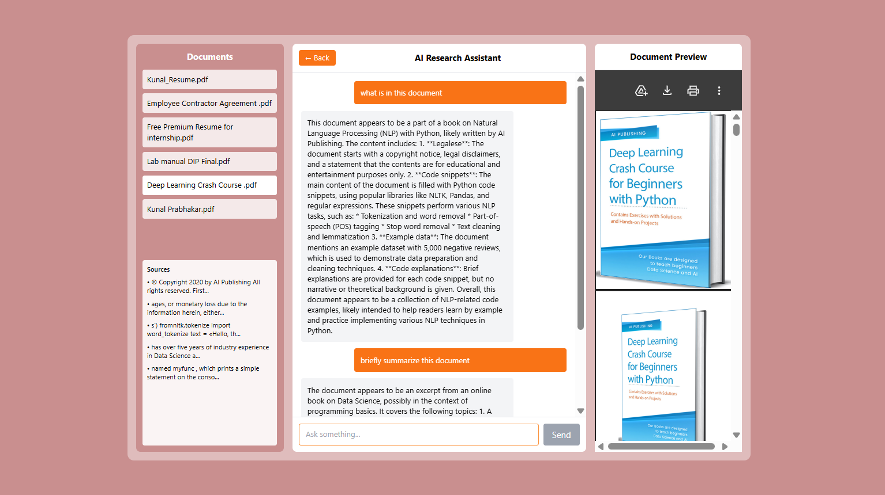

<div align="center">

# 📄 AI Research Assistant

**A full-stack AI platform that lets you upload PDFs and have a real conversation with them.**

Built to demonstrate RAG (Retrieval-Augmented Generation) as a working product — not just a concept.

[](https://ai-research-assistant-five.vercel.app/)
[](https://nextjs.org/)
[](https://www.typescriptlang.org/)
[](https://tailwindcss.com/)
[](https://supabase.com/)
[](https://openai.com/)
[](https://ai-research-assistant-five.vercel.app/)

</div>

---

## ⚡ Try It Right Now

No setup. No sign-up. Just upload a PDF and start asking questions.

| | |
|---|---|
| 🌐 **Live URL** | https://ai-research-assistant-five.vercel.app/ |

---

## 🧠 The Problem It Solves

Reading through long PDFs — research papers, reports, contracts — to find specific answers is slow and frustrating.

AI Research Assistant lets you skip straight to the answer:

- 📄 Upload any PDF document
- 💬 Ask questions in plain language
- 🔍 Get answers traced back to the exact source chunks
- 📚 See which parts of the document the AI used to respond

---

## 🔥 Key Highlights

- Full RAG pipeline built from scratch — chunking, embeddings, vector search, LLM response
- Source-attributed answers — every response is traceable to document sections
- ChatGPT-style UI with persistent conversation history and auto-scroll
- PDF preview with in-app navigation alongside the chat interface

---

## ✨ Features

| Feature | Description |
|---|---|
| 📄 **PDF Upload & Processing** | Extract, chunk, and embed document text on upload |
| 💬 **Conversational Chat** | Ask questions in natural language, get contextual answers |
| 🔍 **Semantic Search** | Vector embeddings power similarity-based retrieval |
| 📚 **Source Attribution** | Responses traced back to specific document chunks |
| 🧠 **RAG Pipeline** | Full retrieval-augmented generation implementation |
| 💾 **Persistent History** | Conversation saved across sessions |
| ⚡ **Real-Time Chat UI** | Auto-scroll, loading states, smooth interaction |
| 👁️ **PDF Preview** | In-app document viewer with page navigation |

---

## 🏗️ How It Works

```
User uploads PDF
        │
        ▼
Text extracted from document
        │
        ▼
Split into chunks
        │
        ▼
Embeddings generated (OpenAI / Groq)
        │
        ▼
Stored in vector database (Supabase + pgvector)
        │
        ▼
User asks a question
        │
        ▼
Query embedded → similarity search → relevant chunks retrieved
        │
        ▼
Chunks + query sent to LLM
        │
        ▼
AI generates contextual, source-attributed answer
```

---

## 🧰 Tech Stack

| Layer | Technology |
|---|---|
| Framework | Next.js (App Router) |
| Styling | Tailwind CSS |
| Backend | Next.js API Routes |
| AI / ML | OpenAI / Groq API + Embeddings |
| Database | Supabase (PostgreSQL + pgvector) |
| Other | PDF parsing, Vector similarity search |
| Deployment | Vercel |

---

## 📸 Screenshots

### 📊 Dashboard


### 💬 Chat Interface + PDF Preview


---

## 🚀 Run Locally

```bash
git clone https://github.com/KUNAL3369/AI-Research-Assistant.git
cd ai-research-assistant
npm install
npm run dev
```

Create a `.env.local` file in the root:

```env
GROQ_API_KEY=your_api_key
NEXT_PUBLIC_SUPABASE_URL=your_url
NEXT_PUBLIC_SUPABASE_ANON_KEY=your_key
```

Open [http://localhost:3000](http://localhost:3000) and you're in.

---

## 🎯 Why This Project Matters

- Implements a full RAG pipeline — not just an API call, but chunking, embedding, retrieval, and generation
- Demonstrates backend thinking alongside frontend — vector DB, API routes, and data flow
- Focuses on real usability — source attribution and PDF preview make it an actual tool, not a demo
- Shows end-to-end AI product development from scratch to deployment

---

## 🔮 Planned Improvements

- [ ] Multi-document querying
- [ ] Highlight exact source text in PDF viewer
- [ ] Streaming responses
- [ ] User authentication + cloud session storage
- [ ] Chat session management UI

---

## 📬 Let's Connect

🟢 **Open to:** Frontend Engineer · Product Engineer · Internal Tools Developer · Startup Software Engineer · AI Application Developer

[](https://www.linkedin.com/in/prabhakarkunal)
[](mailto:kunal.prabhakar3082@gmail.com)

---

<div align="center">

⭐ **Found this useful? Star the repo — it helps others discover it.**

</div>
